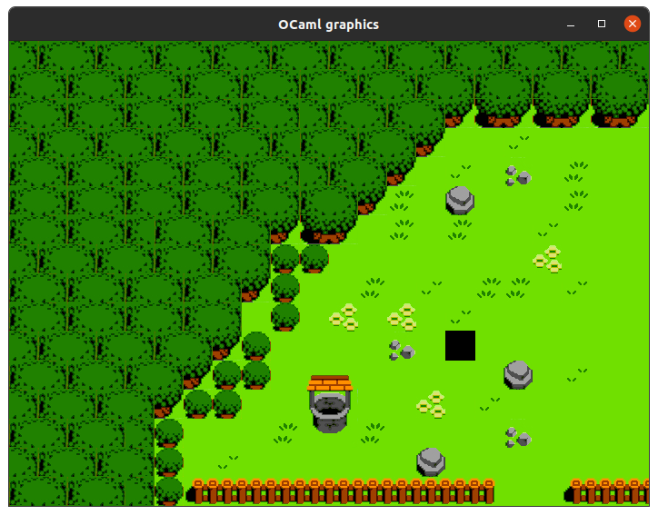
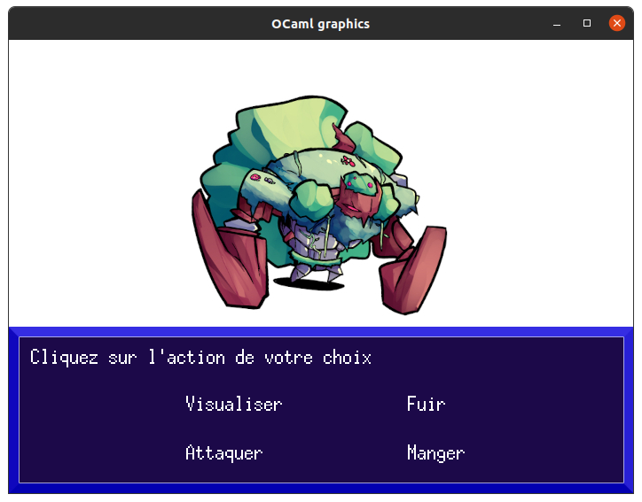
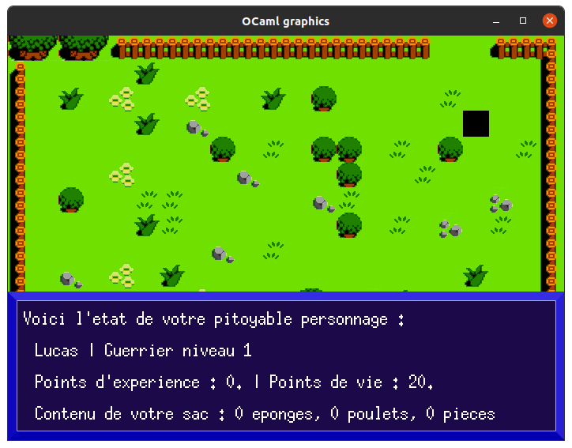
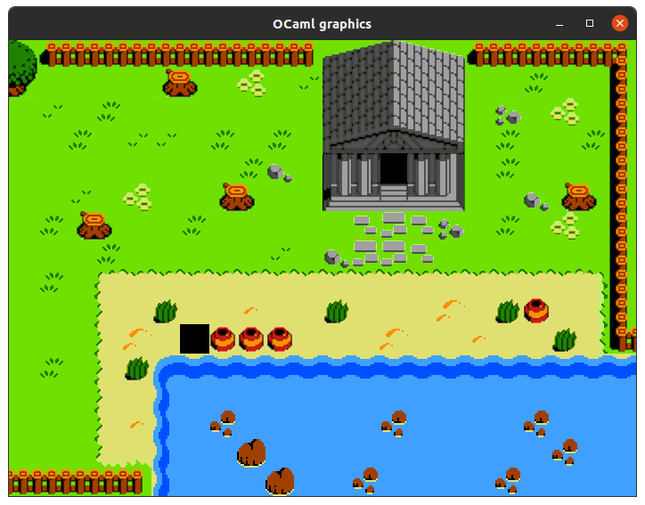

<h1>
  MiniRPG-OCaml
  
</h1>

This project was developed as part of a functional programming course at the University of Orléans. It is written in OCaml and uses the [Graphics module](https://ocaml.org/manual/4.03/libref/Graphics.html) for displaying images. The game is a very basic 2D turn-based RPG, where the player (represented by a simple black square) can explore a small world and fight monsters.

<div style="display: flex; justify-content: center; gap: 20px; margin-bottom: 10px;">
  
  
</div>

<div style="display: flex; justify-content: center; gap: 20px; margin-bottom: 10px;">
  
  
</div>

### 📋 Requirements

```bash
opam install graphics
```

### ▶️ How to run

```bash
# Run these commands from the root directory
ocamlc graphics.cma unix.cma main.ml
ocamlrun a.out
```
### 🖮 Keyboard controls 

<table border="1">
  <tr>
    <th>Key</th>
    <th>Action</th>
  </tr>
  <tr>
    <td>ZQSD</td>
    <td>🧑 Move the character</td>
  </tr>
  <tr>
    <td>I</td>
    <td>🎒 View player status and inventory</td>
  </tr>
  <tr>
    <td>O</td>
    <td>🛏️ Sleep (beware of monsters)</td>
  </tr>
  <tr>
    <td>M</td>
    <td>🍗 Eat a chicken (if the player has some)</td>
  </tr>
  <tr>
    <td>N</td>
    <td>❌ Quit the game</td>
  </tr>
</table>

### 🖼️ Assets
- https://aekashics.itch.io/aekashics-librarium-librarium-static-batch-megapack
- https://opengameart.org/content/zoria-tileset